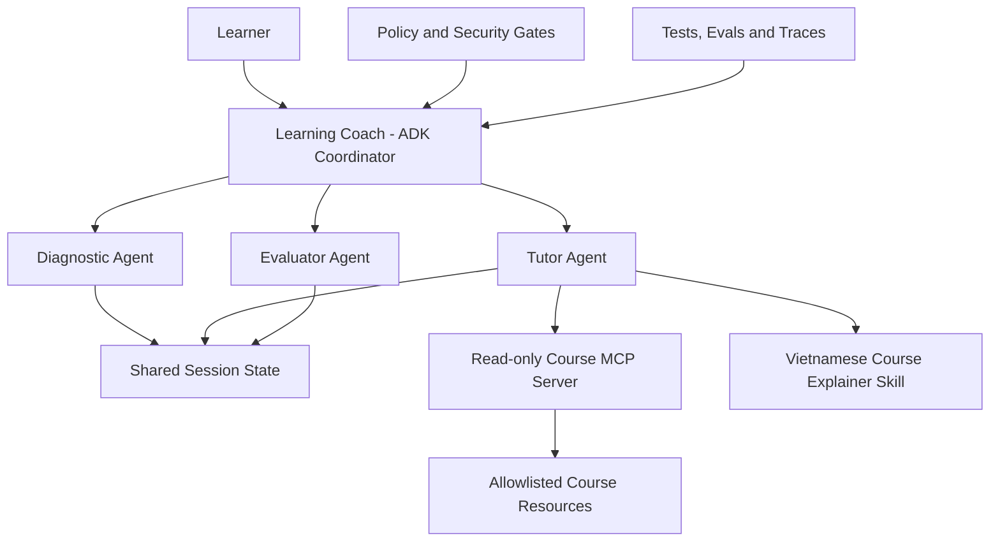

# VietLearn Agent

VietLearn Agent is an adaptive Vietnamese learning assistant that helps learners with limited English and technical background complete English-language technology courses.

The MVP is grounded in the **5-Day AI Agents: Intensive Vibe Coding Course With Google**.

## Problem

Many Vietnamese learners cannot fully benefit from international technology courses because the material assumes both English proficiency and prior technical knowledge. Translation alone does not diagnose knowledge gaps, create a realistic study plan, or adapt after the learner struggles.

## Solution

VietLearn Agent:

1. diagnoses the learner's starting point;
2. creates a time-bounded learning plan;
3. retrieves relevant course material through a read-only MCP server;
4. explains concepts in Vietnamese using an Agent Skill;
5. evaluates understanding with quizzes;
6. adapts the next lesson to observed misconceptions.

## Planned Course Concepts

- ADK multi-agent system
- Read-only MCP server
- Agent Skill with progressive disclosure
- Security policies and prompt-injection defense
- Deterministic tests and agent evaluations

## Architecture



## MVP User Journey

```text
Diagnostic test
→ Learner profile
→ Five-day roadmap
→ Vietnamese lesson
→ Quiz
→ Misconception detection
→ Adaptive recommendation
```

## Local Setup

```powershell
python -m venv .venv
.\.venv\Scripts\python.exe -m pip install -e ".[dev]"
.\.venv\Scripts\python.exe -m pytest
.\.venv\Scripts\python.exe scripts\demo_mcp_client.py
.\.venv\Scripts\python.exe scripts\demo_learning_flow.py
```

The MCP server runs locally over `stdio` and exposes only:

- `search_materials`
- `get_lesson`

## Status

- Day 1: specification and architecture complete.
- Day 2: read-only MCP course server complete.
- Day 3: ADK multi-agent architecture and Vietnamese course explainer skill complete.
- Day 4: security policy, deterministic guardrails, and offline quality evals complete.
- Day 5: structured tracing, regression eval dataset, and end-to-end showcase complete.

## Capstone Evidence

- ADK multi-agent coordinator with three specialists and shared state.
- Read-only MCP course server with an allowlisted catalog.
- Vietnamese teaching Agent Skill with progressive disclosure.
- Security policy, prompt-injection guardrail, quality evals, and redacted traces.
- Submission draft: `docs/capstone_submission.md`.

## Repository Structure

```text
vietlearn-agent/
├── README.md
├── AGENTS.md
├── specs/
├── app/
├── mcp/
├── .agents/skills/
├── policies/
├── evals/
├── tests/
└── docs/
```

## Security Principles

- No secrets in the repository.
- Retrieved content is treated as untrusted data.
- Course MCP tools are read-only.
- File access is allowlisted.
- Destructive changes require explicit confirmation.

## License

License to be selected before public submission.
